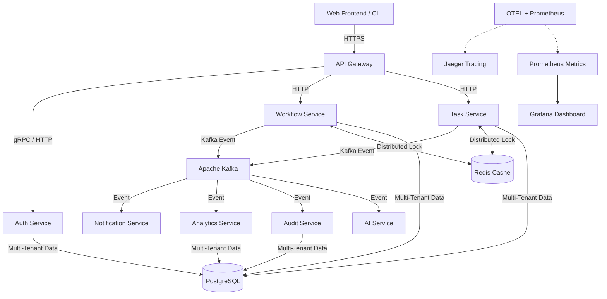

# 🚀 Enterprise Workflow Automation Platform (EWAP)

[](https://opensource.org/licenses/MIT)
[]()
[]()
[]()
[]()

A production-grade, enterprise-ready, **multi-tenant workflow orchestration and automation platform**. EWAP combines the visual workflow building of Salesforce Flow, the robust task management of Jira, and the IT process automation of ServiceNow into a high-performance distributed microservice architecture.

---

## 🏗️ System Architecture

EWAP is built as a highly decoupled monorepo containing **8 microservices**, powered by a shared distributed event bus (Kafka), high-performance distributed locks (Redis), dynamic multi-tenant schema partitioning (PostgreSQL), and robust observability.



---

## 🌟 Key Features

* **Multi-Tenant Schema Isolation**: PostgreSQL database schemas are dynamically generated per tenant upon registration, ensuring complete data security and compliance.
* **Distributed State Machine**: The core workflow engine executes sequential, branching, and delay-based steps asynchronously with distributed locks.
* **Kafka Event Bus**: Highly scalable inter-service communication ensuring eventual consistency and audit trail completeness.
* **AI-Powered Workflow Generation**: Uses LangChain + Hugging Face (`meta-llama/Meta-Llama-3-8B-Instruct`) to generate workflow definition JSON from natural language prompts.
* **Insert-Only Audit Trail**: An enterprise-compliant audit logger designed as an insert-only service, safeguarding all history against deletion.
* **Premium Observability**: Full OpenTelemetry distributed tracing integrated with Jaeger, paired with Prometheus metrics and a pre-configured Grafana monitoring dashboard.

---

## 🛠️ Microservice Registry

| Service Name | Port | Description | Design Highlight |
| :--- | :--- | :--- | :--- |
| **`api-gateway`** | `4000` | Secure routing, rate limiting, and tenant extraction. | Built-in token verification & rate limiters |
| **`auth-service`** | `4001` | Multi-tenant RBAC administration & authentication. | Raw SQL multi-schema runtime router |
| **`workflow-service`** | `4002` | State machine runner executing user-defined automation. | Distributed locking with `ioredis` & NX keys |
| **`task-service`** | `4003` | Task assigner & coordinator for manual human approvals. | Distributed task state controller |
| **`notification-service`** | `4004` | Multi-channel messaging (Email, Slack) with smart retries. | Exponential backoff retry handler |
| **`analytics-service`** | `4005` | Event aggregator reporting workflow execution velocities. | Time-series data processor |
| **`ai-service`** | `4006` | Hugging Face powered text-to-workflow JSON translator. | LLM parsing with robust Zod validation |
| **`audit-service`** | `4007` | Compliance ledger tracking every mutation. | Guaranteed insert-only Kafka consumer |

---

## 📁 Repository Structure

```
├── .github/             # GitHub Actions CI/CD workflows
├── packages/            # Shared libraries (internal npm packages)
│   ├── shared/          # Common types, schemas, and utility functions
│   ├── kafka-client/    # Wrapper for Kafka producers and consumers
│   └── telemetry/       # OpenTelemetry and Prometheus initialization scripts
├── services/            # Microservices (scaffolded with Dockerfiles)
│   ├── api-gateway/
│   ├── auth-service/
│   ├── workflow-service/
│   ├── task-service/
│   ├── notification-service/
│   ├── analytics-service/
│   ├── ai-service/
│   └── audit-service/
├── frontend/            # Vite + React 18 + Tailwind dashboard application
├── e2e/                 # E2E test suites powered by Playwright
└── infrastructure/      # Infrastructure deployment & configuration
    ├── docker/          # Docker-compose setups for database, cache, Kafka
    ├── k8s/             # Helm charts for Kubernetes deployments
    ├── prometheus/      # Prometheus scrape configurations
    └── grafana/         # Grafana dashboard JSON models
```

---

## 🚀 Getting Started

### Prerequisites

- **Node.js** v20+
- **pnpm** v9+
- **Docker & Docker Compose**

### 1. Installation

Clone the repository and install all dependencies:
```bash
pnpm install
```

### 2. Infrastructure Setup

Launch the database, cache, Kafka broker, and observability tools:
```bash
cd infrastructure/docker
docker-compose up -d
```

### 3. Kafka Topics Setup

Initialize all required event streams:
```bash
# Execute the topic initialization script inside the Kafka container
docker-compose exec kafka bash /kafka/create-topics.sh
```

### 4. Build and Run

Build all shared packages and microservices, then boot the development environment:
```bash
# Build the workspace
pnpm run build

# Start all microservices and frontend in development mode
pnpm run dev
```

---

## 📊 Observability & Monitoring

EWAP comes with fully pre-configured dashboards. Once the infrastructure is running, you can access the monitoring interfaces at the following addresses:

* **Grafana Dashboard**: [http://localhost:3001](http://localhost:3001) (Preloaded with Request Rates, SLO indicators, and DLQ tracking)
* **Jaeger Tracing UI**: [http://localhost:16686](http://localhost:16686) (View system-wide distributed traces)
* **Kafka UI**: [http://localhost:8080](http://localhost:8080) (Inspect topics, consumer lag, and event payloads)
* **Prometheus Targets**: [http://localhost:9090](http://localhost:9090)

---

## 🧪 Running Tests

### E2E Tests
To run the critical-path end-to-end integration tests:
```bash
cd e2e
npm install
npx playwright install --with-deps
npx playwright test
```

---

## 📝 License

Distributed under the MIT License. See `LICENSE` for more information.
